## GMMImgSegmentation
A tiny project using GMM to segment imgs.
This is done by:
1. First convert the image from RGB color space into RG color space
2. Then assume the pixels to be points from K different multiple dimentional Gaussians
3. Apply EM methods to obtain the fitted data points
### Example picture
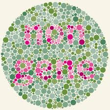 
### K=3 Case
#### Picture converted into rg space
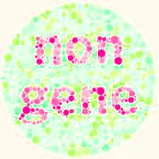
#### Greyscale pictures reflect how likely(the possibility)that a pixel will lay in one Gaussian component.
+ White: More likely 
+ Black: Less likely

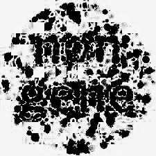  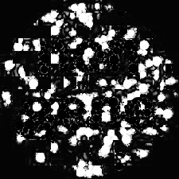
#### Color distribution and Gaussians fitted
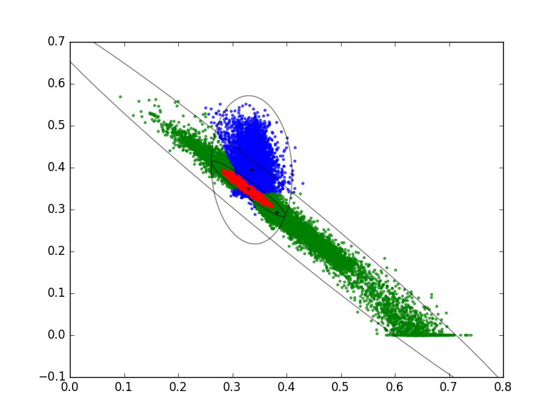

### K=4 Case
#### Greyscale pictures reflect how likely(the possibility)that a pixel will lay in one Gaussian component.
 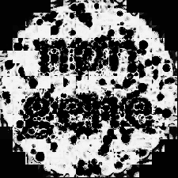 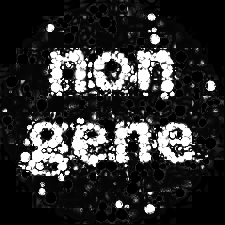 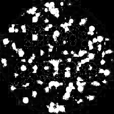
#### Color distribution and Gaussians fitted
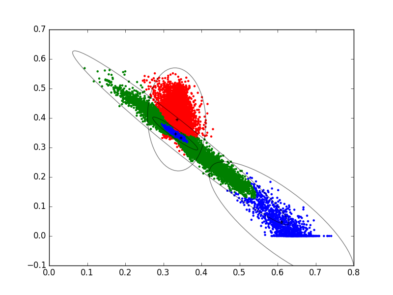

### K=5 Case(notice the over-fit)
#### Greyscale pictures reflect how likely(the possibility)that a pixel will lay in one Gaussian component.
  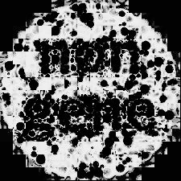 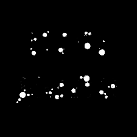 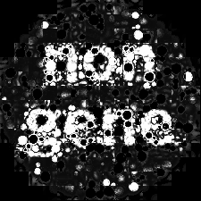
#### Color distribution and Gaussians fitted
+Notice the tiny green located in blue area
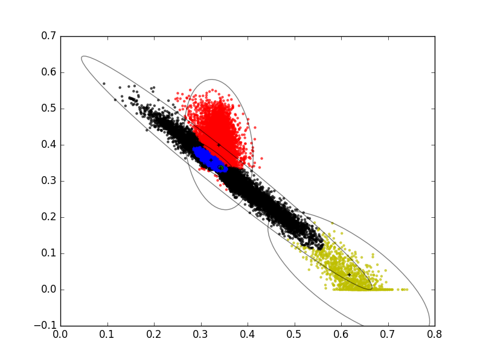
